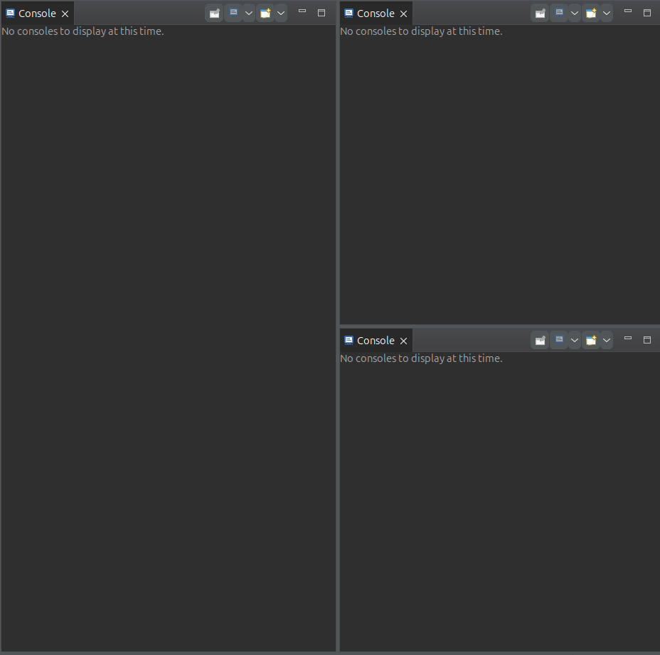

# P2P Communication System

## Overview

Project done as part of assignment for subject Distributed Systems @ Leibniz Universität Hannvoer (Dr. Jan Simon Rellermeyer).
The task was to implemeent an extension/service on top of the custom messaging protocol.

This project is a Peer-to-Peer (P2P) communication system implemented in Java. It includes a client-server architecture where clients can exchange messages and manage peers efficiently. The system supports both TCP and UDP communication protocols.

## Features

-   P2P messaging system
-   Supports TCP and UDP protocols
-   Message handling with `MessageSender` and `MessageReceiver`
-   Peer management with `PeerManagementServer`
-   Common message types and user entities for structured communication

## Project Structure

```
project/
|-- client/
|   |-- ChatClient.java
|   |-- MessageSender.java
|   |-- MessageReceiver.java
|   |-- MessageHandler.java
|   |-- Wrapper.java
|   |-- Settings.java
|-- common/
|   |-- Message.java
|   |-- MessageType.java
|   |-- User.java
|-- p2p/
|   |-- Command.java
|   |-- Peer.java
|   |-- PeerInfo.java
|   |-- PeerManagementServer.java
|   |-- PeerManager.java
|-- utils/
|   |-- ConnectionInfo.java
|   |-- NetClient.java
|   |-- SandboxedFileSystem.java
|   |-- StringFormatUtils.java
|   |-- TCP_Client.java
|   |-- UDP_Client.java
|   |-- Worker.java
```

## Requirements

-   Java 11 or later

## Installation

1. Clone the repository:
    ```sh
    git clone https://github.com/LUH-VSS/assignment-1-AnisAbdellatif ds_project
    ```
2. Navigate to the project directory:
    ```sh
    cd ds_project
    ```

## Usage

1. First, it is best to open 2 (or more) console views, like this:
   

2. Start the PMS

3. Spawn as many peers as you want and setup console veiws accordingly.

4. There are 2 files setup as examples to transfer in ./files/ which are:
   test.txt : a simple text file.
   filesystem: a binary executable for linux.
